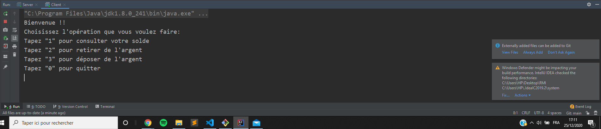
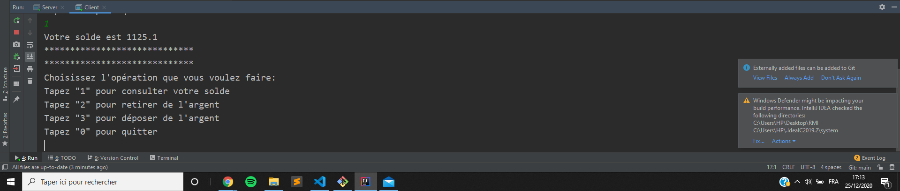
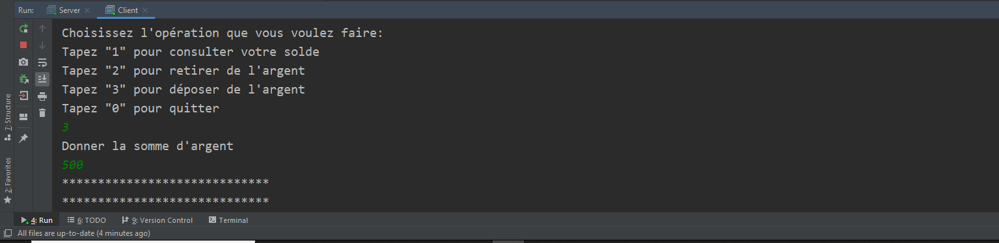
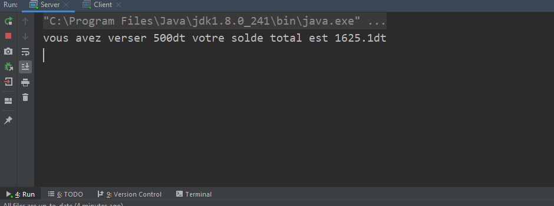
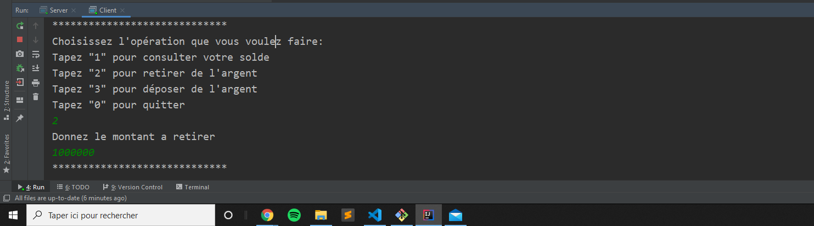
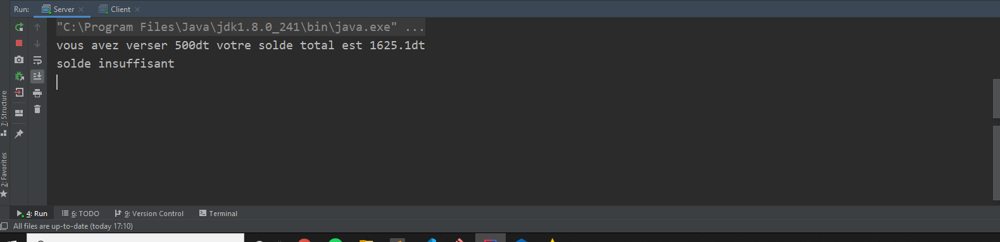

# Gestion de compte bancaire RMI

## Demo
1. ### Il faut tout d'abord lancer le serveur puis le client.
### Pour cosulter le solde il faut entrer la valeur 1 au clavier.

2. ### Pour verser de l'argent il faut entrer la valeur 3 au clavier.
### Puis donner la somme à verser

### le serveur affiche le résultat de l'opération

3. ### Pour retirer de l'argent il faut entrer la valeur 2 au clavier.
### Puis  donner la somme a retirer

### le serveur affiche le résultat de l'opération

